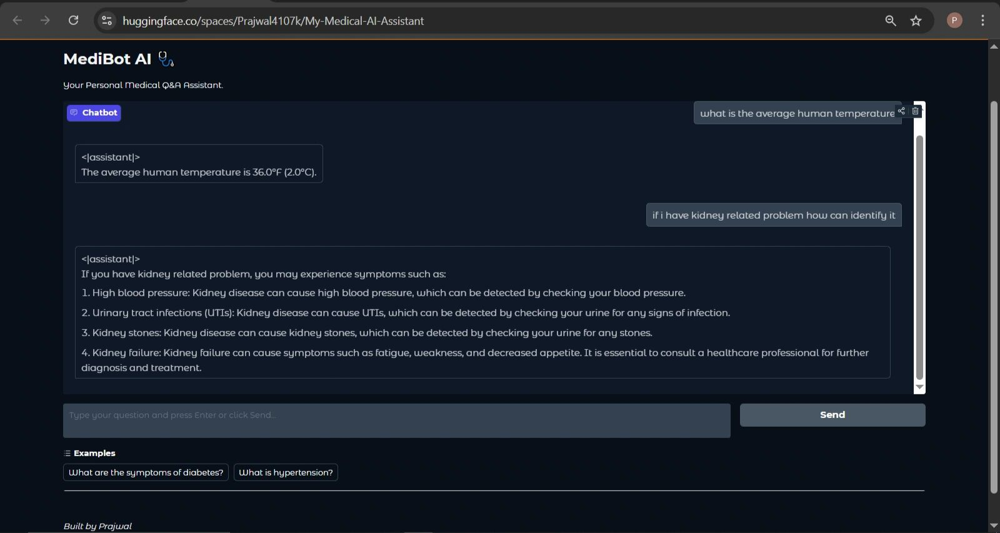
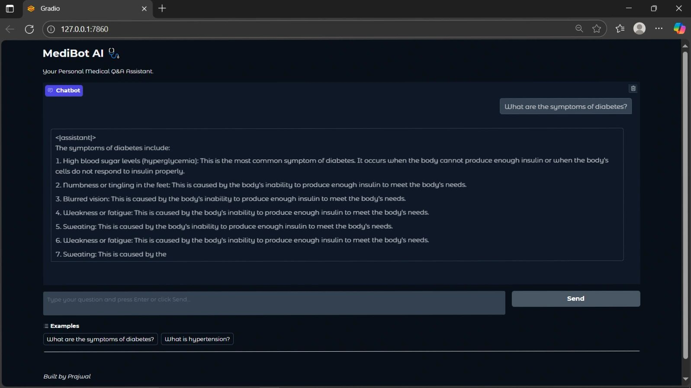

# 🏥 MediBot AI — My Medical AI Assistant

<div align="center">


**A fine-tuned TinyLlama 1.1B medical chatbot trained on a custom medical Q&A dataset using QLoRA — deployed live on HuggingFace Spaces with a Gradio UI.**

[🤗 Live Demo](https://huggingface.co/spaces/Prajwal4107k/My-Medical-AI-Assistant) · [✨ Features](#-features) · [🧪 Model Details](#-model-details) · [🚀 Getting Started](#-getting-started)

</div>

---

## 📌 Table of Contents

- [Overview](#-overview)
- [Live Demo](#-live-demo)
- [Features](#-features)
- [Model Details](#-model-details)
- [Tech Stack](#️-tech-stack)
- [Project Structure](#-project-structure)
- [How It Works](#️-how-it-works)
- [Getting Started](#-getting-started)
- [Disclaimer](#️-disclaimer)
- [License](#-license)

---

## 🧠 Overview

**MediBot AI** is a domain-specific medical chatbot built by fine-tuning **TinyLlama-1.1B-Chat** on a custom `medical_qa.csv` dataset using **QLoRA (Quantized Low-Rank Adaptation)**. It answers medical questions covering symptoms, diseases, drug information, general health advice, and more — all through a clean **Gradio web interface** deployed on HuggingFace Spaces.

This project demonstrates a full LLM fine-tuning pipeline: from dataset preparation → QLoRA training → adapter merging → Gradio deployment.

---

## 🌐 Live Demo

🤗 **[https://huggingface.co/spaces/Prajwal4107k/My-Medical-AI-Assistant](https://huggingface.co/spaces/Prajwal4107k/My-Medical-AI-Assistant)**

### 💬 MediBot AI — Symptom Query

> Asking *"What are the symptoms of diabetes?"* — MediBot responds with a detailed, numbered breakdown of diabetes symptoms including hyperglycemia, numbness, blurred vision, and fatigue.

---

### 🩺 MediBot AI — Multi-turn Medical Q&A

> Multi-turn conversation on HuggingFace Spaces — the bot correctly answers *"What is the average human temperature?"* and provides detailed kidney disease symptom identification when asked.

---

## ✨ Features

- 🤖 **Fine-tuned LLM** — TinyLlama 1.1B Chat, fine-tuned specifically on medical Q&A data
- 💊 **Medical Q&A** — Answers questions about symptoms, diseases, and conditions
- 🌡️ **Symptom Checker** — Identifies possible conditions based on described symptoms
- 💉 **Drug Information** — Provides general information about medications
- 🩺 **General Medical Advice** — Health tips, normal ranges, body metrics
- 🖥️ **Gradio Web UI** — Clean, dark-themed chat interface with example prompts
- 🤗 **HuggingFace Spaces** — Publicly accessible live deployment
- ⚡ **QLoRA Training** — Efficient fine-tuning with 4-bit quantization using PEFT

---

## 🧪 Model Details

| Property | Value |
|----------|-------|
| **Base Model** | `TinyLlama/TinyLlama-1.1B-Chat-v0.6` |
| **Fine-tuning Method** | QLoRA (4-bit quantization + LoRA adapters) |
| **Library** | PEFT (Parameter Efficient Fine-Tuning) |
| **Pipeline** | `text-generation` |
| **Training Data** | `medical_qa.csv` (custom Medical Q&A dataset) |
| **Chat Template** | Jinja2 (`chat_template.jinja`) |
| **Adapter Format** | SafeTensors (`adapter_model.safetensors`) |
| **Tags** | `lora`, `transformers`, `TinyLlama-adapter` |

---

## 🛠️ Tech Stack

| Component | Technology |
|-----------|------------|
| **Base LLM** | TinyLlama 1.1B Chat |
| **Fine-tuning** | QLoRA via PEFT + bitsandbytes |
| **Training Script** | `fine_tune_qlora.py` |
| **Framework** | HuggingFace Transformers |
| **UI** | Gradio |
| **Deployment** | HuggingFace Spaces |
| **Language** | Python 3.10+ |
| **Data Format** | CSV (`medical_qa.csv`) + JSON (`dataset.json`) |

---

## 📁 Project Structure

```
My-Medical-AI-Assistant-Code/
│
├── fine_tuned_model/                   # Trained LoRA adapter files
│   ├── adapter_config.json             # LoRA adapter configuration
│   ├── adapter_model.safetensors       # Fine-tuned adapter weights
│   ├── chat_template.jinja             # Custom chat prompt template
│   ├── special_tokens_map.json         # Special tokens mapping
│   ├── tokenizer.json                  # Tokenizer vocabulary
│   ├── tokenizer.model                 # SentencePiece tokenizer model
│   ├── tokenizer_config.json           # Tokenizer configuration
│   └── README.md                       # Model card
│
├── .gradio/
│   └── certificate.pem                 # Gradio SSL certificate
│
├── app.py                              # Gradio app — chat interface
├── fine_tune_qlora.py                  # QLoRA fine-tuning script
├── medical_qa.csv                      # Medical Q&A training dataset
├── dataset.json                        # Processed dataset in JSON format
├── test_imports.py                     # Dependency verification script
├── requirements.txt                    # Python dependencies
└── README.md
```

---

## ⚙️ How It Works

```
medical_qa.csv  →  dataset.json
      │
      ▼
┌──────────────────────────────┐
│   fine_tune_qlora.py         │
│                              │
│  • Load TinyLlama-1.1B-Chat  │
│  • 4-bit quantization        │
│  • Attach LoRA adapters      │
│  • Train on medical Q&A      │
│  • Save adapter weights      │
└──────────────┬───────────────┘
               │
               ▼
    fine_tuned_model/
    adapter_model.safetensors
               │
               ▼
┌──────────────────────────────┐
│         app.py               │
│                              │
│  • Load base model           │
│  • Merge LoRA adapter        │
│  • Apply chat template       │
│  • Launch Gradio UI          │
└──────────────┬───────────────┘
               │
               ▼
    ┌─────────────────────┐
    │   MediBot AI        │  ←  User asks medical question
    │   Gradio Chat UI    │  →  LLM generates answer
    └─────────────────────┘
               │
               ▼
    HuggingFace Spaces 🤗
    (Public live deployment)
```

---

## 🚀 Getting Started

### Prerequisites

- Python 3.10+
- GPU recommended (CUDA) for inference; CPU works but is slower
- HuggingFace account (for model access)

---

### 1. Clone the Repository

```bash
git clone https://github.com/prajwal5065/My-Medical-AI-Assistant-Code.git
cd My-Medical-AI-Assistant-Code
```

---

### 2. Install Dependencies

```bash
pip install -r requirements.txt
```

Core packages include:
```
transformers
peft
bitsandbytes
gradio
torch
accelerate
datasets
```

---

### 3. Verify Imports

```bash
python test_imports.py
```

---

### 4. (Optional) Re-run Fine-tuning

```bash
python fine_tune_qlora.py
```

> ⚠️ Requires a CUDA GPU. The script loads `medical_qa.csv`, applies 4-bit quantization, trains LoRA adapters, and saves them to `fine_tuned_model/`.

---

### 5. Launch the Gradio App

```bash
python app.py
```

The MediBot AI interface will open at `http://127.0.0.1:7860`

---

### 6. Or Use the Live Demo

No setup needed — just visit:

🤗 **[https://huggingface.co/spaces/Prajwal4107k/My-Medical-AI-Assistant](https://huggingface.co/spaces/Prajwal4107k/My-Medical-AI-Assistant)**

---

## ⚠️ Disclaimer

> **MediBot AI is for informational and educational purposes only.**
> It is NOT a substitute for professional medical advice, diagnosis, or treatment.
> Always consult a qualified healthcare professional for medical decisions.
> Never ignore professional medical advice because of something this AI has said.

---

## 📄 License

This project is licensed under the **MIT License** — see the [LICENSE](LICENSE) file for details.

---

<div align="center">

Built with ❤️ by [Prajwal](https://github.com/prajwal5065)

🤗 **[Try MediBot AI Live on HuggingFace Spaces](https://huggingface.co/spaces/Prajwal4107k/My-Medical-AI-Assistant)**

⭐ Star this repo if you found it helpful!

</div>
